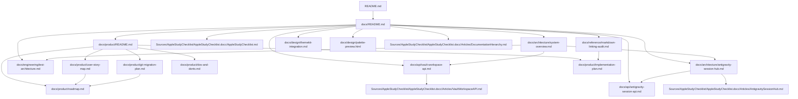

# Mapa da Documentação

Este repositório organiza a documentação por `category` e `scope`.

O objetivo é simples:

- documentos pequenos continuam fáceis de encontrar
- conjuntos maiores de docs podem crescer sem colapsar em uma pasta plana
- cada fluxo importante pode apontar para código, testes e API docs relacionados

## Categorias

- `product/`: objetivos, roadmap, restrições e regras de produto
- `design/`: interação, UI, Figma e comportamento visual
- `engineering/`: fluxo de implementação, testes e regras de engenharia
- `architecture/`: estrutura sistêmica e limites
- `api/`: comportamento exposto por módulos, contratos e integrações
- `reference/`: padrões externos, tooling e opções futuras

## Padrão de idioma

- documentação e DocC narrativo em `pt-BR`
- código, símbolos, nomes de arquivo e contratos técnicos em inglês
- UI e apresentação localizadas por idioma selecionado
- ao editar um documento já existente, normalizar a parte tocada para `pt-BR`

## Escopos

- `repository`: regras que valem para o repositório inteiro
- `system`: arquitetura e fluxo transversal
- `feature`: uma fatia de produto, como o workspace do vault
- `component`: um tipo, módulo ou área de UI

## Regra de rastreabilidade

Quando um documento descreve comportamento entregue, ele deve apontar para:

1. os arquivos-fonte relacionados
2. os testes relacionados
3. a documentação de API ou artigo DocC aplicável

## Hierarquia atual

```text
docs/
├── README.md
├── architecture/
│   ├── README.md
│   ├── antigravity-session-hub.md
│   └── system-overview.md
├── api/
│   ├── README.md
│   ├── antigravity-session-api.md
│   └── vault-workspace-api.md
├── design/
│   ├── README.md
│   ├── figma-prototype-brief.md
│   ├── palette-preview.html
│   ├── themekit-integration.md
│   └── system-ui-ux-spec.md
├── engineering/
│   ├── README.md
│   ├── project-patterns.md
│   ├── tdd-workflow.md
│   └── test-architecture.md
├── product/
│   ├── README.md
│   ├── dos-and-donts.md
│   ├── git-migration-plan.md
│   ├── implementation-plan.md
│   ├── roadmap.md
│   └── user-story-map.md
└── reference/
    ├── README.md
    ├── external-standards.md
    ├── language-standard.md
    ├── markdown-linking-audit.md
    └── provider-auth-and-sync.md
```

## Dependências principais entre documentos



## Fluxo de atualização

Para um novo sistema ou feature:

1. se a feature mudar navegação, sessão, revisão ou sync, fechar protótipo antes do código
2. atualizar o documento de produto ou arquitetura mais próximo
3. adicionar ou ajustar os testes correspondentes
4. atualizar o documento de API se o contrato mudou
5. atualizar o catálogo DocC quando a mudança afetar a estrutura para desenvolvimento
